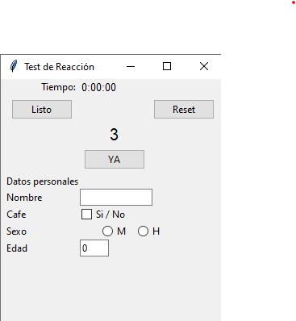
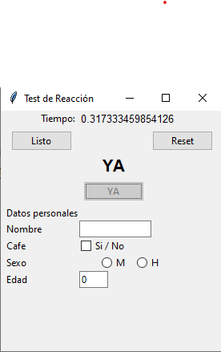
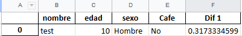

# Reaction Time

## Description
Simple tkinter GUI program for measuring reaction time of a person before and after drinking coffee. Made for a statistics course project. 
Adds the time difference to a Pandas DataFrame and into an Excel file "resultados.xlsx". Made 

---

Simple programa con interfaz de tkinter para medir tiempo de reaccion de una persona antes y despues de tomar café. 
Al mostrarse un mensaje en un intervalo de tiempo aleatorio se presiona un boton. Luego es guardado a un
archivo excel "resultados.xlsx".

---
## Requirements
Python 3.6.6

	- datetime
	- os
	- threading
	- random
	- time
	- xldr
	- pandas
	- openpyxl

	Optionally
	- cx_Freeze - 5.1.1 (for compiling .exe)

## To Run

Simply run reaction_main.py. 

1. Listo / Ready
2. Cuenta regresiva / Countdown

3. Click YA when "YA" shows.

4. Records details to .xlsx

If you would like to create an executable with cx_Freeze you must use **Python 3.6.6.**

### To create Windows excecutable
	1. install cx_Freeze == 5.1.1
	2. cd into directory
	2. run: "python setup.py build_exe"
